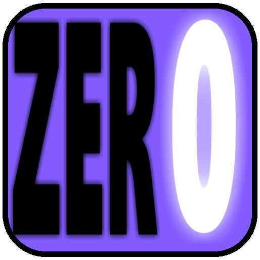

# Zer0Skill 
## Logo 

## Description
Zer0 est un bot discord, qui a pour utilité de relier différents projets réalisés précédemment. Sont implémentés :

- [Flaggergaster](https://github.com/ChickenInKFCgit/FlagGergaster)
- [AnnoyingText](https://github.com/ChickenInKFCgit/annoyingtext)
- [ChestHunt Simulator Idle Slayer](https://github.com/ChickenInKFCgit/Chest-Hunt-Simulator-Idle-Slayer)
- (_autres projets qui seront ajoutés prochainement_)

Ces projets sont reliés via le module GitPython (et sont ici appellés _services_).
Chacun de ces projets correspond en réalité à un clone du repository du projet associé. 
 

Ce projet a une structure modulaire, avec comme entry point [bot.py](link:bot/bot.py).

## Commandes 
### Commandes liées à la gestion des repositories
| Commande                | Description     |
| ----------------------- | --------------- |
| /services_introuvables  | Donne la liste de tous les services qui n'ont pas pu être lancés.    | 
| /services_obtain        | Charge tous les services introuvables depuis github. Requiert un redémarrage pour prendre effet. (_correspond à une série de clone_)  | 
| /services_update        | Met à jour chacun des services à la version disponible sur github. (_correspond à une série de pull_)  | 
| /restart                | pour redémarrer le bot afin d'actualiser les nouveaux services clonés   | 
| /services_force         | /service_obtain → /service_update → /restart (_permet d'assurer la bonne mise à jour des services_)  |

### Commandes des repositories implémentés
| Commande                | Description     |
| ----------------------- | --------------- |
| /annoying_text          | Permet de randomiser les lettres du texte fourni.    |  
| /chest_hunt_simulator_idle_slayer          | Lance une simulation de **x** simulations de chacune **y** chasses aux trésors. Renvoie le tableau comparatif pour chaque algorithme comparé selon : le nombre moyen de mimics par partie tués, le nombre de coffres moyens ouverts par partie, le WinRate, et enfin le nombre de victoires comparés au nombre de parties.    |   
